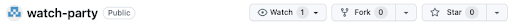
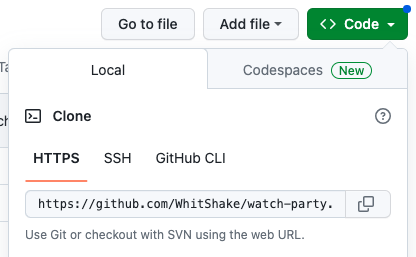
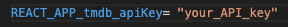
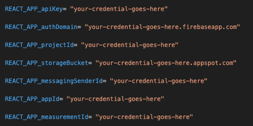
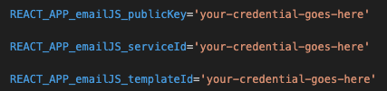

# Watch Party

Watch party is a social app to connect friends through movies. You can view the currently deployed project on: [Netlify](https://ada-watch-party.netlify.app/)

All visitors to the app can:
- Get a random suggestion for a movie to watch, along with details about that movie.

When signed in, users can:
- Search for movies to watch by title, person (actor, director, or producer), or a similar movie.
- Get specific details about a movie.
- Create playlists of movies and store them in the user’s shelf.
- Record movies the user has watched.
- Connect with friends.
- View a friend’s stored data, including profile information, saved playlists and watched movies.
- Send an invitation to a friend to watch a movie.

## Getting Started

This project was bootstrapped with [Create React App](https://github.com/facebook/create-react-app).

### Available Scripts

In the project directory, you can run:

#### `npm start`
Runs the app in the development mode.\
Open [http://localhost:3000](http://localhost:3000) to view it in the browser.


#### `npm test`
Launches the test runner in the interactive watch mode.\
See the section about [running tests](https://facebook.github.io/create-react-app/docs/running-tests) for more information.


### Learn More

You can learn more in the [Create React App documentation](https://facebook.github.io/create-react-app/docs/getting-started).

To learn React, check out the [React documentation](https://reactjs.org/).


## Installation

1. Fork this repository


2. Clone the repository. Copy the address to the repository in Github.


3. In terminal, navigate to your desired location for the project and clone the repository into that folder: \
    ```bash
    $ git clone ...
    ```

4. Use the ls command to confirm the project is stored in your desired location.
Navigate into the project folder using the cd command and install dependencies:

    ```bash
    $ cd watch party
    $ npm install
    ```

5. Create a .env file in the project directory to store personal keys and OAuth tokens.


## Authentication

### TMDB

This project uses the TMDB API database to access movie information. Accessing the TMDB API requires an API key or OAuth token. 

To request an API key:

1. Create a personal account on the [TMDB website](https://developer.themoviedb.org/) by clicking the Log In button in the upper right corner: 
2. Once logged in to your account, you can [request an API key here](https://www.themoviedb.org/settings/api)
3. Add your API key to the .env file: \

4. To learn more about TMDB’s available endpoints, [see the documentation](https://developer.themoviedb.org/v4/reference/intro/getting-started)


### Firestore Database

This project uses [Firestore Database](firebase.google.com) to store user information. To access the database:

1. Obtain the Firebase project’s credentials.
2. Include the credentials in your .env file: 


Note: For security reasons, sensitive credentials are not included in the project directory. Please contact the repository owner for information on accessing and using the project's required Firestore credentials.

### EmailJS

This project uses [EmailJS](https://www.emailjs.com/). To use EmailJS, you will need an account and three credentials: an API key, a service id, and a template id. Once you obtain credentials, include them in your .env file.


For more information on EmailJS, refer to the [documentation](https://www.emailjs.com/docs/)


## Contributing

To contribute to this project:
1. Fork the repository.
2. Create a new branch for your feature or bug fixes:
    ```bash
    $ git checkout -b branch-name
    ```
3. Add, commit, and push your changes to your fork.
4. Create a pull request, explaining your changes.

